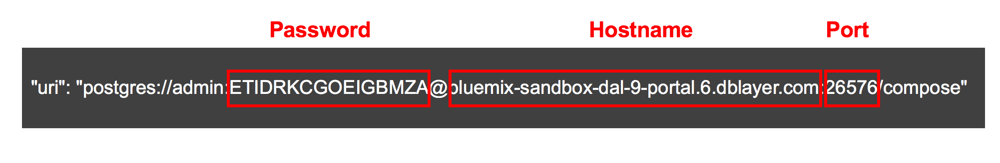
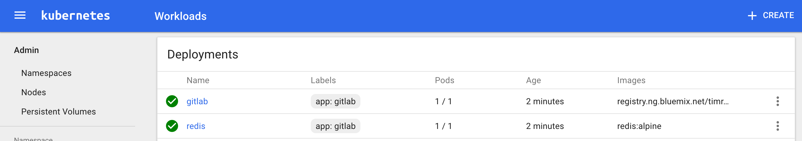

[](https://travis-ci.org/IBM/Kubernetes-container-service-GitLab-sample)

# 将 GitLab 部署到 Kubernetes 集群上

*阅读本文的其他语言版本：[English](README.md)。*

本项目展示，如何将一个常见的多组件工作负载（在本例中是 GitLab）部署到 Kubernetes 集群上。GitLab 因其基于 Git 的代码跟踪工具而流行。GitLab 代表着一种典型的多层应用程序，每个组件都拥有自己的容器。微服务容器将用于 Web 层，状态/作业数据库使用 Redis 和 PostgreSQL 作为数据库。

通过使用不同的 GitLab 组件（NGINX、Ruby on Rails、Redis、PostgreSQL 等），可以将它部署到 Kubernetes 上。也可以使用 Bluemix 中的 Compose for PostgreSQL 作为数据库来部署这个示例。


1.用户通过 Web 接口或通过将代码推送到 GitHub 存储库来与 GitLab 交互。GitLab 容器运行 NGINX 和 gitlab-workhorse 背后的主要 Ruby on Rails 应用程序，gitlab-workhorse 是一个针对大型 HTTP 请求的逆向代理，比如文件下载和 Git 推送/拉取请求。在通过 HTTP/HTTPS 提供存储库时，GitLab 利用 GitLab API 来解决授权和访问，并提供 Git 对象。

2.经过身份验证和授权后，GitLab Rails 应用程序将传入的作业、作业信息和元数据放在 Redis 作业队列上，该作业队列充当着一个非持久数据库。

3.存储库创建于本地文件系统中。

4.用户创建用户、角色、合并请求、组等信息 - 所有这些信息然后存储在 PostgreSQL 中。

5.用户运行 Git shell 来访问存储库。

## 包含的组件
- [GitLab](https://about.gitlab.com/)
- [PostgreSQL](https://www.postgresql.org/)
- [Redis](https://redis.io/)
- [Kubernetes Clusters](https://console.ng.bluemix.net/docs/containers/cs_ov.html#cs_ov)
- [IBM Cloud Container Service](https://console.ng.bluemix.net/catalog/?taxonomyNavigation=apps&category=containers)
- [IBM Cloud Compose for PostgreSQL](https://console.ng.bluemix.net/catalog/services/compose-for-postgresql)

## 目标
这个场景提供以下任务的操作说明和经验：

- 构建容器并将它们存储在容器注册表中
- 使用 Kubernetes 创建本地持久卷来定义持久磁盘
- 使用 Kubernetes pod 和服务部署容器
- 在 Kubernetes 应用程序中使用 IBM Cloud 服务
- 将一个分布式 GitLab 部署到 Kubernetes 上

## 部署场景

### 使用 Docker 部署

参阅[使用 Docker 部署 Gitlab](docs/deploy-with-docker.md)

### 部署到 Kubernetes

如果希望将此 Gitlab 安装在 IBM Cloud Private 上，使用 [Deploying Gitlab to IBM Cloud Private](docs/deploy-with-ICP.md) ，否则按照以下说明执行。

使用 [Minikube](https://kubernetes.io/docs/getting-started-guides/minikube) 创建一个 Kubernetes 集群用于测试，或者使用 [IBM Cloud Container Service](https://github.com/IBM/container-journey-template#container-journey-template---creating-a-kubernetes-cluster) 创建一个 Kubernetes 集群以部署到云中。这里的代码会定期使用 Travis 针对[来自 IBM Cloud Container Service 的 Kubernetes 集群](https://console.ng.bluemix.net/docs/containers/cs_ov.html#cs_ov) 进行测试。

如果想使用 IBM Cloud Container Registry，首先需要[将映像上传](docs/use-bluemix-container-registry) 到 IBM Cloud Container Registry。

### 使用 DevOps Toolchain 从 IBM Cloud Container Service 部署到 Kubernetes 集群
如果想将 Gitlab 直接部署到 IBM Cloud，可单击下面的 Deploy to IBM Cloud 按钮，创建一个 [IBM Cloud DevOps 服务工具链和管道](https://console.ng.bluemix.net/docs/services/ContinuousDelivery/toolchains_about.html#toolchains_about) 来部署 Gitlab 示例，否则可跳到[步骤](#steps)

[](https://console.ng.bluemix.net/devops/setup/deploy/)

请按照[工具链操作说明](https://github.com/IBM/container-journey-template/blob/master/Toolchain_Instructions_new.md) 完成您的工具链和管道。

#### 步骤

1.[使用 Kubernetes 创建服务和部署](#1-use-kubernetes-to-create-services-and-deployments-for-gitlab-redis-and-postgresql)

  - 1.1 [在容器中使用 PostgreSQL](#11-use-postgresql-in-container) 或
  
  - 1.2 [使用来自 IBM Cloud 的 PostgreSQL](#12-use-postgresql-from-bluemix)
  
2.[获取用于 GitLab 的外部 IP 和端口](#2-retrieve-external-ip-and-port-for-gitlab)

3.[GitLab 已准备就绪！使用 GitLab 托管您的存储库](#3-gitlab-is-ready-use-gitlab-to-host-your-repositories)


#### 1.使用 Kubernetes 为 GitLab、Redis 和 PostgreSQL 创建服务并执行部署

运行 `kubectl` 命令确保您的 Kubernetes 集群可供访问。  

```bash
$ kubectl get nodes
NAME             STATUS    AGE       VERSION
x.x.x.x          Ready     17h       v1.5.3-2+be7137fd3ad68f
```

> 备注：如果这一步失败，请参阅 [Minikube](https://kubernetes.io/docs/getting-started-guides/minikube) 或 [IBM Cloud Container Service](https://console.ng.bluemix.net/docs/containers/cs_troubleshoot.html#cs_troubleshoot) 上的故障排除文档。

##### 1.1 在容器中使用 PostgreSQL

如果使用容器映像来运行 PostgreSQL，可对您的 Kubernetes 集群运行以下命令或运行快速入门脚本 `bash quickstart.sh`。

```bash
$ kubectl create -f kubernetes/local-volumes.yaml
$ kubectl create -f kubernetes/postgres.yaml
$ kubectl create -f kubernetes/redis.yaml
$ kubectl create -f kubernetes/gitlab.yaml
```

创建所有这些服务和部署后，等待 3 到 5 分钟。可以在 Kubernetes UI 上检查部署状态。运行 kubectl proxy 并访问 URL 'http://127.0.0.1:8001/ui  '，以检查 GitLab 容器何时准备就绪。


接下来[获取用于 GitLab 的外部 IP 和端口](#2-retrieve-external-ip-and-port-for-GitLab)

##### 1.2 使用来自 IBM Cloud 的 PostgreSQL

使用 IBM Cloud 目录或 bx 命令创建 Compose for PostgreSQL 的一个服务实例，并添加一组凭证。

```bash
$ bx service create compose-for-postgresql Standard "Compose for PostgreSQL-GL"
$ bx service key-create "Compose for PostgreSQL-GL" Credentials-1
```

从 IBM Cloud 上的该服务的凭证对象获取连接字符串。

```bash
$ bx service key-show "Compose for PostgreSQL-GL" "Credentials-1" | grep "postgres:"
```



修改您的 ```kubernetes/gitlab-postgres-svc.yaml ``` 文件，将 COMPOSE_PG_PASSWORD 替换为密码，COMPOSE_PG_HOST 替换为主机名，COMPOSE_PG_PORT 替换为端口。 

使用上面的示例后，```env:``` 节将类似于下面的清单。

```yaml
  env:
  - name: GITLAB_OMNIBUS_CONFIG
  value: |
      postgresql['enable'] = false
      gitlab_rails['db_username'] = "admin"
      gitlab_rails['db_password'] = "ETIDRKCGOEIGBMZA"
      gitlab_rails['db_host'] = "bluemix-sandbox-dal-9-portal.6.dblayer.com"
      gitlab_rails['db_port'] = "26576"
      gitlab_rails['db_database'] = "compose"
      gitlab_rails['db_adapter'] = 'postgresql'
      gitlab_rails['db_encoding'] = 'utf8'
      redis['enable'] = false
      gitlab_rails['redis_host'] = 'redis'
      gitlab_rails['redis_port'] = '6379'
      gitlab_rails['gitlab_shell_ssh_port'] = 30022
      external_url 'http://gitlab.example.com:30080'

```


对您的 Kubernetes 集群运行以下命令或运行快速入门脚本 `bash quickstart-postgres-svc.sh`。

```bash
$ kubectl create -f kubernetes/local-volumes.yaml
$ kubectl create -f kubernetes/redis.yaml
$ kubectl create -f kubernetes/gitlab-postgres-svc.yaml
```

创建所有这些服务和部署后，等待 3 到 5 分钟。可以在 Kubernetes UI 上检查部署状态。运行 kubectl proxy 并访问 URL 'http://127.0.0.1:8001/ui '，以检查 GitLab 容器何时准备就绪。



### 2.获取用于 GitLab 的外部 IP 和端口

几分钟后，运行以下命令来获取您的公共 IP 和 NodePort 编号。

```bash
$ $ bx cs workers <cluster_name>
OK
ID                                                 Public IP       Private IP     Machine Type   State    Status   
kube-hou02-pa817264f1244245d38c4de72fffd527ca-w1   169.47.241.22   10.10.10.148   free           normal   Ready 
$ kubectl get svc gitlab
NAME      CLUSTER-IP     EXTERNAL-IP   PORT(S)                     AGE
gitlab    10.10.10.148   <nodes>       80:30080/TCP,22:30022/TCP   2s
```

> 备注：30080 端口用于 gitlab UI，30022 端口用于 ssh。

> 备注：gitlab 外部 URL 设置为 `gitlab.example.com`，将此 URL 添加到指向上面的 IP 地址的 hosts 文件中，以便使用 gitlab 期望的 URL。如果不能这么做，使用该 IP（在本例中为 169.47.241.22）应该没问题。

> 备注：如果使用 Minikube 执行本地 Kubernetes 部署，可以使用 `minikube service list` 命令访问服务 IP 列表。

恭喜您。现在可以从 Web 浏览器使用链接 [http://gitlab.example.com:30080](http://gitlab.example.com:30080) 或 http://<node_ip>:30080 访问您的 gitlab 服务了。

### 3.GitLab 已准备就绪！使用 GitLab 托管您的存储库

Gitlab 运行后，您可以[注册为新用户并创建一个项目](docs/using-gitlab.md)。

### 故障排除

如果一个 pod 未启动，请检查日志。
```bash
kubectl get pods
kubectl logs <pod name>
```

### 清理

要删除所有服务、部署和持久卷声明，可运行

```bash
kubectl delete deployment,service,pvc -l app=gitlab
```

要删除持久卷，可运行

```bash
kubectl delete pv local-volume-1 local-volume-2 local-volume-3
```

要删除您的 PostgreSQL 凭证并从 IBM Cloud 删除服务实例，可运行

```bash
bx service key-delete "Compose for PostgreSQL-GL" Credentials-1
bx service delete "Compose for PostgreSQL-GL"
```

# 许可证
[Apache 2.0](LICENSE)
