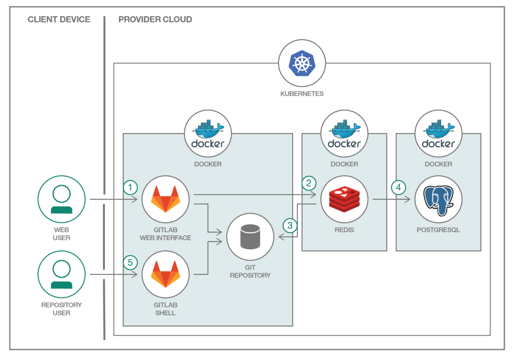
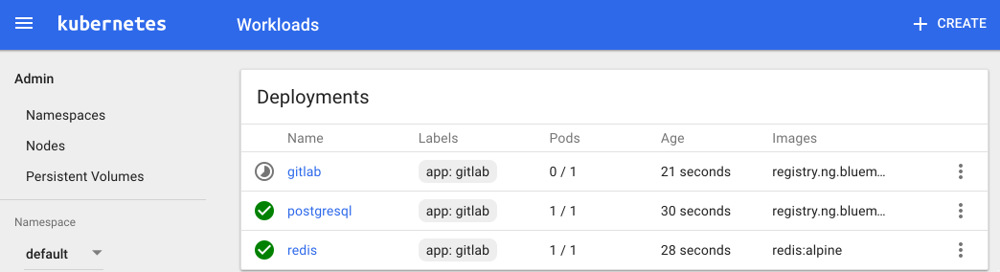
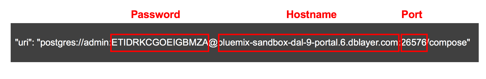
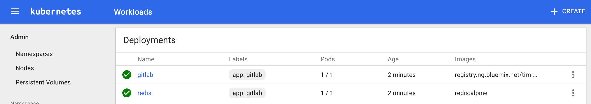

[](https://travis-ci.org/IBM/Kubernetes-container-service-GitLab-sample)

# Implementação do GitLab no cluster Kubernetes

*Ler em outros idiomas: [한국어](README.ko.md).*

Este projeto mostra como uma carga de trabalho comum com vários componentes (no caso, o GitLab) pode ser implementada no cluster Kubernetes. O GitLab é famoso pela ferramenta de acompanhamento de código com base em Git. O GitLab representa um aplicativo típico multicamada; cada componente terá seus próprios contêineres. Os contêineres de microsserviços serão para a camada da web, enquanto o banco de dados de estado/tarefa é com Redis e PostgreSQL como banco de dados.

Utilizando diferentes componentes do GitLab (NGINX, Ruby on Rails, Redis, PostgreSQL e muito mais), é possível implementá-lo no Kubernetes. Este exemplo também pode ser implementado com Compose for PostgreSQL no Bluemix como banco de dados.


1. O usuário interage com o GitLab pela interface da web ou enviando um código por push para um repositório do GitHub. O contêiner do GitLab executa o aplicativo principal Ruby on Rails atrás do NGINX e do cavalo de batalha do GitLab, que é um proxy reverso para grandes solicitações de HTTP, como downloads de arquivos e push/pull de Git. Enquanto atende repositórios por HTTP/HTTPS, o GitLab utiliza a API GitLab para resolver a autorização e o acesso, além de atender objetos Git.
2. Após a autenticação e a autorização, o aplicativo GitLab Rails coloca as tarefas recebidas, as informações das tarefas e os metadados na fila de tarefas do Redis, que funciona como um banco de dados não persistente.
3. Os repositórios são criados em um sistema de arquivos local.
4. O usuário cria usuários, funções, solicitações de mesclagem, grupos e muito mais. Em seguida, tudo é armazenado em PostgreSQL.
5. Para acessar o repositório, o usuário entra por meio do shell Git.

## Componentes inclusos
- [GitLab](https://about.gitlab.com/)
- [PostgreSQL](https://www.postgresql.org/)
- [Redis](https://redis.io/)
- [Clusters Kubernetes](https://console.ng.bluemix.net/docs/containers/cs_ov.html#cs_ov)
- [Bluemix Container Service](https://console.ng.bluemix.net/catalog/?taxonomyNavigation=apps&amp;category=containers)
- [Bluemix Compose for PostgreSQL](https://console.ng.bluemix.net/catalog/services/compose-for-postgresql)

## Objetivos
Este cenário fornece instruções e aprendizado para as seguintes tarefas:
- Desenvolver contêineres e armazená-los no registro de contêineres
- Usar o Kubernetes para criar volumes persistentes locais a fim de definir discos persistentes
- Implementar contêineres usando pods e serviços do Kubernetes
- Usar o serviço do Bluemix em aplicativos Kubernetes
- Implementar um GitLab distribuído no Kubernetes ## Cenários de implementação

### Implementar usando Docker
Consulte [Implementando o GitLab com o Docker](docs/deploy-with-docker.md)

### Implementar no Kubernetes
Crie um cluster Kubernetes com [Minikube](https://kubernetes.io/docs/getting-started-guides/minikube) para testes locais ou com [IBM Bluemix Container Service](https://github.com/IBM/container-journey-template#container-journey-template---creating-a-kubernetes-cluster) para implementar na cloud.

Aqui, o código é testado regularmente com relação ao [Cluster Kubernetes do Bluemix Container Service](https://console.ng.bluemix.net/docs/containers/cs_ov.html#cs_ov) usando o Travis.

Se quiser usar o Bluemix Container Registry, comece [Fazendo o upload das imagens](docs/use-bluemix-container-registry) no Bluemix Container Registry.
### Implementar usando a cadeia de ferramentas do DevOps no cluster Kubernetes a partir do Bluemix Container Service
Se quiser implementar o GitLab diretamente no Bluemix, clique no botão 'Deploy to Bluemix' abaixo para criar uma [cadeia de ferramentas de serviços do Bluemix DevOps e um canal](https://console.ng.bluemix.net/docs/services/ContinuousDelivery/toolchains_about.html#toolchains_about) para implementação da amostra do GitLab ou avance para [Etapas](#steps)

[](https://console.ng.bluemix.net/devops/setup/deploy/)

 Siga as [instruções da cadeia de ferramentas](https://github.com/IBM/container-journey-template/blob/master/Toolchain_Instructions_new.md) para concluir a cadeia de ferramentas e o canal.

#### Etapas
1. [Usar o Kubernetes para criar serviços e implementações](#1-use-kubernetes-to-create-services-and-deployments-for-gitlab-redis-and-postgresql)
- 1.1 [Usar o PostgreSQL no contêiner](#11-use-postgresql-in-container) ou
- 1.2 [Usar o PostgreSQL a partir do Bluemix](#12-use-postgresql-from-bluemix)
2. [Recuperar IP externo e porta para o GitLab](#2-retrieve-external-ip-and-port-for-gitlab)
3. [O GitLab está pronto! Usar o GitLab para hospedar seus repositórios](#3-gitlab-is-ready-use-gitlab-to-host-your-repositories)

#### 1. Usar o Kubernetes para criar serviços e implementações para GitLab, Redis e PostgreSQL

Para conferir se seu cluster Kubernetes pode ser acessado, execute o comando `kubectl`.
 ```bash
 $ kubectl get nodes NAME STATUS AGE VERSION x.x.x.x Ready 17h v1.5.3-2+be7137fd3ad68f
 ```
  > Observação: em caso de falha nesta etapa, consulte os documentos de resolução de problemas no [Minikube](https://kubernetes.io/docs/getting-started-guides/minikube) ou no [IBM Bluemix Container Service](https://console.ng.bluemix.net/docs/containers/cs_troubleshoot.html#cs_troubleshoot).

##### 1.1 Usar o PostgreSQL em contêiner

Se estiver usando uma imagem de contêiner para executar o PostgreSQL, execute os comandos a seguir ou execute o script de iniciação rápida `./scripts/quickstart.sh` com seu cluster Kubernetes.

```bash
$ kubectl create -f kubernetes/local-volumes.yaml
$ kubectl create -f kubernetes/postgres.yaml
$ kubectl create -f kubernetes/redis.yaml
$ kubectl create -f kubernetes/gitlab.yaml
```
Depois de criar todos os serviços e implementações, aguarde entre três e cinco minutos. É possível verificar o status da implementação na interface com o usuário do Kubernetes. Execute 'kubectl proxy' e acesse a URL 'http://127.0.0.1:8001/ui' para verificar quando o contêiner do GitLab ficará pronto.



A seguir, [recupere o IP externo e a porta para o GitLab](#2-retrieve-external-ip-and-port-for-GitLab)

##### 1.2 Usar o PostgreSQL a partir do Bluemix
Use o catálogo do Bluemix ou o comando bx para criar uma instância de serviço do Compose for PostgreSQL e incluir um conjunto de credenciais.
```bash
$ bx service create compose-for-postgresql Standard "Compose for PostgreSQL-GL"
$ bx service key-create "Compose for PostgreSQL-GL" Credentials-1
```
Recupere a cadeia de caractere de conexão do objeto de credenciais para o serviço no Bluemix.
```bash
$ bx service key-show "Compose for PostgreSQL-GL" "Credentials-1" | grep "postgres:"
```


Modifique seu arquivo ```kubernetes/gitlab-postgres-svc.yaml``` e substitua COMPOSE_PG_PASSWORD pela senha, COMPOSE_PG_HOST pelo nome do host e COMPOSE_PG_PORT pela porta.

Usando o exemplo acima, a seção ```env:``` terá esta aparência.

```yaml
env:
- name: GITLAB_OMNIBUS_CONFIG
value: |
  postgresql['enable'] = false
  gitlab_rails['db_username'] = "admin"
  gitlab_rails['db_password'] = "ETIDRKCGOEIGBMZA"
  gitlab_rails['db_host'] = "bluemix-sandbox-dal-9-portal.6.dblayer.com"
  gitlab_rails['db_port'] = "26576"
  gitlab_rails['db_database'] = "compose"
  gitlab_rails['db_adapter'] = 'postgresql'
  gitlab_rails['db_encoding'] = 'utf8'
  redis['enable'] = false
  gitlab_rails['redis_host'] = 'redis'
  gitlab_rails['redis_port'] = '6379'
  gitlab_rails['gitlab_shell_ssh_port'] = 30022
  external_url 'http://gitlab.example.com:30080'
```

Execute os comandos a seguir ou execute o script de iniciação rápida `./scripts/quickstart-postgres-svc.sh` com seu cluster Kubernetes.

```bash
$ kubectl create -f kubernetes/local-volumes.yaml
$ kubectl create -f kubernetes/redis.yaml
$ kubectl create -f kubernetes/gitlab-postgres-svc.yaml
```
Depois de criar todos os serviços e implementações, aguarde entre três e cinco minutos. É possível verificar o status da implementação na interface com o usuário do Kubernetes. Execute 'kubectl proxy' e acesse a URL 'http://127.0.0.1:8001/ui' para verificar quando o contêiner do GitLab ficará pronto. 



### 2. Recuperar o IP externo e a porta para o GitLab

Depois de alguns minutos, execute os comandos a seguir para obter o IP público e o número da NodePort.
```bash
$ $ bx cs workers <cluster_name>
OK ID Public IP Private IP Machine Type State Status
kube-hou02-pa817264f1244245d38c4de72fffd527ca-w1 169.47.241.22 10.10.10.148 free normal Ready
$ kubectl get svc gitlab
NAME CLUSTER-IP EXTERNAL-IP PORT(S) AGE
gitlab 10.10.10.148   <nodes>       80:30080/TCP,22:30022/TCP 2s
```
> Observação: a porta 30080 é para a IU do GitLab; a porta 30022 é para ssh.

> Observação: a URL externa do GitLab foi definida como `gitlab.example.com`. Inclua no arquivo de hosts que aponta para seu endereço IP de cima, a fim de usar a URL esperada pelo GitLab. Caso não consiga fazer isso, o uso do IP (neste exemplo, 169.47.241.22) deve funcionar.

> Observação: se estiver usando o Minikube para implementação local no Kubernetes, você poderá acessar a lista de IPs de serviço com o comando `minikube service list`.

Parabéns. Agora você pode usar o link [http://gitlab.example.com:30080](http://gitlab.example.com:30080) ou http://<node_ip>:30080 para acessar o serviço do GitLab a partir do seu navegador da web.

### 3. O GitLab está pronto! Usar o GitLab para hospedar seus repositórios

Agora que o GitLab está em execução, é possível [se inscrever como novo usuário e criar um projeto](docs/using-gitlab.md).

##Resolução de problemas

Se um pod não for iniciado, examine os logs.
```bash
kubectl get pods kubectl logs <pod name>
```


## Limpeza
Para excluir todos os seus serviços, implementações e solicitação de volume persistente, execute
```bash
kubectl delete deployment,service,pvc -l app=gitlab
```
Para excluir o volume persistente, execute
```bash
kubectl delete pv local-volume-1 local-volume-2 local-volume-3
```
Para excluir as credenciais do PostgreSQL e remover a instância de serviço do Bluemix, execute
```bash
bx service key-delete "Compose for PostgreSQL-GL" Credentials-1
bx service delete "Compose for PostgreSQL-GL"
```
# Licença
[Apache 2.0](LICENÇA)
