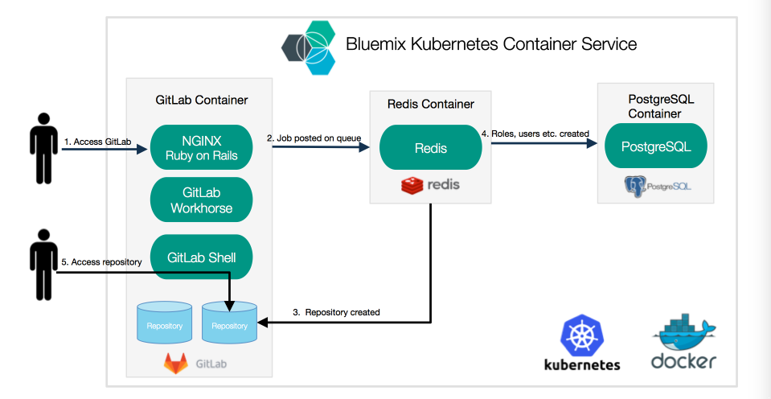

[](https://travis-ci.org/IBM/kubernetes-container-service-gitlab-sample)

# GitLab deployment on Bluemix Kubernetes Container Service

## Overview
This project shows how a common multi-component application can be deployed on the Bluemix Kubernetes Container service. Bluemix Container Service combines Docker and Kubernetes to deliver powerful container orchestration.

GitLab represents a typical multi-tier app and each component will have their own container(s). The microservice containers will be for the web tier, the state/job database with Redis and PostgreSQL as the database.

The user interacts with GitLab via the web interface or by pushing code to a Git repo. The GitLab container runs the main Ruby on Rails application behind NGINX and gitlab-workhorse, which is a reverse proxy for large HTTP requests like file downloads and Git push/pull. When serving repositories over HTTP/HTTPS, GitLab utilizes the GitLab API to resolve authorization and access as well as serving Git objects.



## Included Components
- Bluemix container service
- Kubernetes
- GitLab
- NGINX
- Redis
- PostgreSQL

## Prerequisite

Create a Kubernetes cluster with IBM Bluemix Container Service. 

If you have not setup the Kubernetes cluster, please follow the [Creating a Kubernetes cluster](https://github.com/IBM/container-journey-template) tutorial.


## Steps

1. [Install Docker CLI and Bluemix Container registry Plugin](#1-install-docker-cli-and-bluemix-container-registry-plugin)
2. [Build PostgreSQL and Gitlab containers](#2-build-postgresql-and-gitlab-containers)
3. [Create Services and Deployments](#3-create-services-and-deployments)
4. [Using Gitlab](#4-using-gitlab)

# 1. Install Docker CLI and Bluemix Container Registry Plugin


First, install [Docker CLI](https://www.docker.com/community-edition#/download).

Then, install the Bluemix container registry plugin.

```bash
bx plugin install container-registry -r bluemix
```

Once the plugin is installed you can log into the Bluemix Container Registry.

```bash
bx cr login
```

If this is the first time using the Bluemix Container Registry you must set a namespace which identifies your private Bluemix images registry. It can be between 4 and 30 characters.

```bash
bx cr namespace-add <namespace>
```

Verify that it works.

```bash
bx cr images
```


# 2. Build PostgreSQL and GitLab containers

PostgreSQL and GitLab containers need to be built. Redis container can be used as is from Docker Hub

Build the PostgreSQL container.

```bash
cd containers/postgres
docker build -t registry.ng.bluemix.net/<namespace>/gitlab-postgres .
docker push registry.ng.bluemix.net/<namespace>/gitlab-postgres
```

Build the Gitlab container.

```bash
cd containers/gitlab
docker build -t registry.ng.bluemix.net/<namespace>/gitlab .
docker push registry.ng.bluemix.net/<namespace>/gitlab
```


After finish building the images in bluemix registery, please modify the container images in your yaml files. 

i.e. 
1. In postgres.yaml, change `docker.io/tomcli/postgres:latest` to `registry.ng.bluemix.net/<namespace>/gitlab-postgres`
2. In gitlab.yaml, change `docker.io/tomcli/gitlab:latest` to `registry.ng.bluemix.net/<namespace>/gitlab`

> Note: Replace `<namespace>` to your own container registry namespace. You can check your namespace via `bx cr namespaces`

# 3. Create Services and Deployments

Run the following commands or run the quickstart script `bash quickstart.sh` with your Kubernetes cluster.

```bash
kubectl create -f local-volumes.yaml
kubectl create -f postgres.yaml
kubectl create -f redis.yaml
kubectl create -f gitlab.yaml
```

After you created all the services and deployments, wait for 3 to 5 minutes. You can check the status of you deployment on Kubernetes UI. Run kubectl proxy and check when GitLab container becomes ready.


After few minutes the following commands to get your public IP and NodePort number.

```bash
$ kubectl get nodes
NAME             STATUS    AGE
169.47.241.106   Ready     23h
$ kubectl get svc gitlab
NAME      CLUSTER-IP     EXTERNAL-IP   PORT(S)                     AGE
gitlab    10.10.10.148   <nodes>       80:30080/TCP,22:30022/TCP   2s
```

> Note: The 30080 port is for gitlab UI and the 30022 port is for ssh.

Congratulation. Now you can use the link **http://[IP]:30080** to access your gitlab site on browser.

> Note: For the above example, the link would be http://169.47.241.106:30080  since its IP is 169.47.241.106 and the UI port number is 30080. 


# 4. Using Gitlab
Now that Gitlab is running you can register as a new user and create a project.


After logging in as your newly-created user you can create a new project.


Once a project has been created you'll be asked to add an SSH key for your user.

To verify that your key is working correctly run:

```bash
ssh -T git@<IP> -p 30022
```

Which should result in:

```bash
Welcome to GitLab, <user>!
```

Now you can clone your project.
```bash
git clone ssh://git@<IP>:30022/<user>/<project name>
```

Add a file and commit:
```bash
echo "Gitlab project" > README.md
git add README.md
git commit -a -m "Initial commit"
git push origin master
```

You can now see it in the Gitlab UI.


# Troubleshooting
If a pod doesn't start examine the logs.
```bash
kubectl get pods
kubectl logs <pod name>
```


To delete all your services, deployments, and persistent volume claim, run

```bash
kubectl delete deployment,service,pvc -l app=gitlab
```

To delete your persistent volume, run

```bash
kubectl delete pv local-volume-1 local-volume-2 local-volume-3
```

# License
[Apache 2.0](LICENSE.txt)
