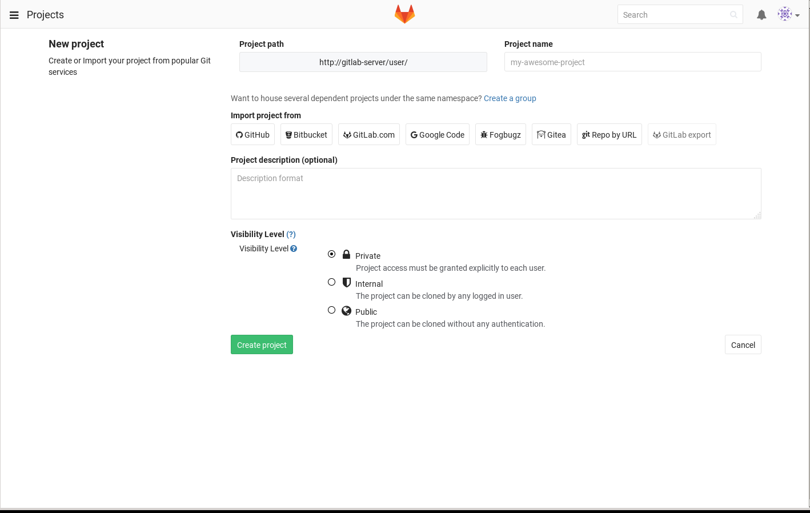
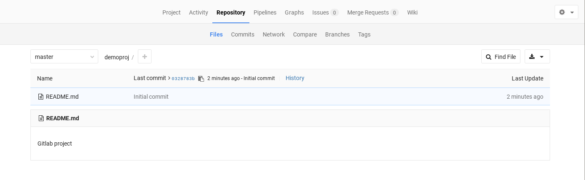

# Using gitlab 


After logging in as your newly-created user you can create a new project.



Once a project has been created you'll be asked to add an SSH key for your user.

To verify that your key is working correctly run:

```bash
ssh -T git@gitlab.example.com -p 30022
```

Which should result in:

```bash
Welcome to GitLab, <user>!
```

> Note: Remember you need to have modified your hosts file to use the URL provided, otherwise you'll need to use the node's IP address as described [here](../README.md#2-retrieve-external-ip-and-port-for-gitLab).

Now you can clone your project.
```bash
git clone ssh://git@gitlab.example.com:30022/<user>/<project name>
```

Add a file and commit:
```bash
echo "Gitlab project" > README.md
git add README.md
git commit -a -m "Initial commit"
git push origin master
```

You can now see it in the Gitlab UI.



If you want to use http URLs for cloning and pushing to a public repository on GitLab, that`s enabled as well.
