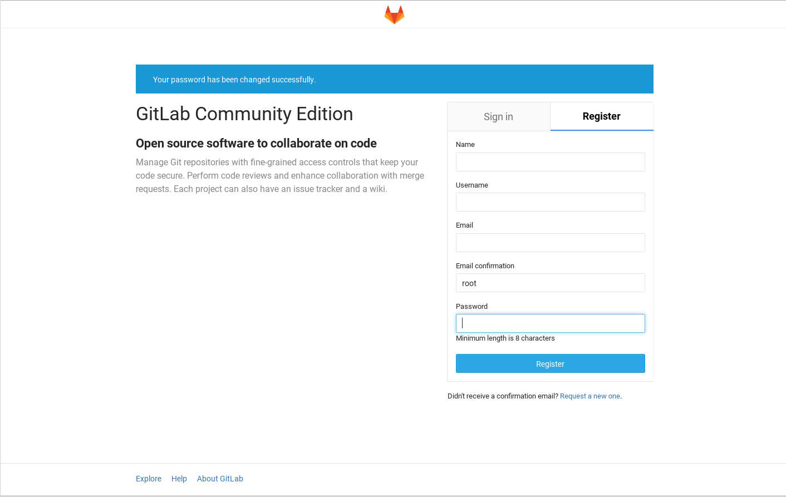
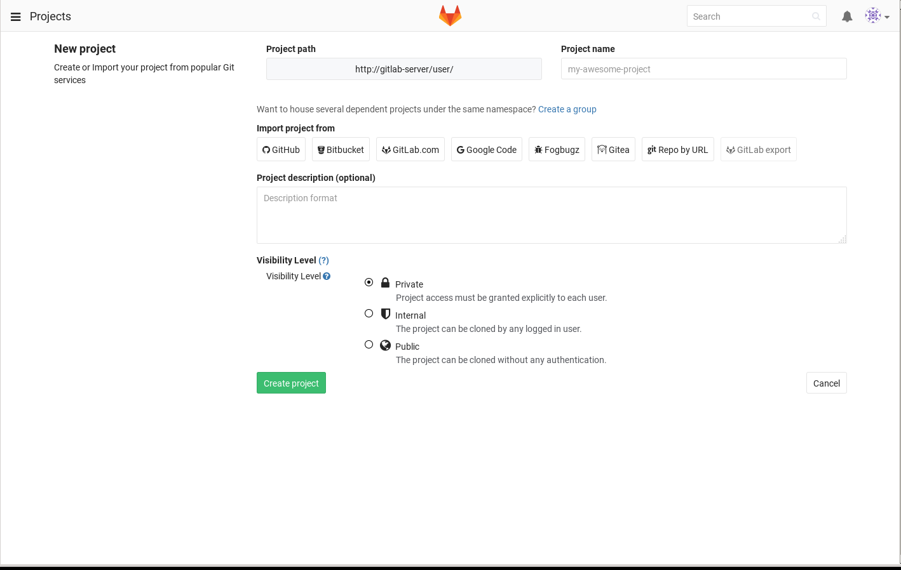
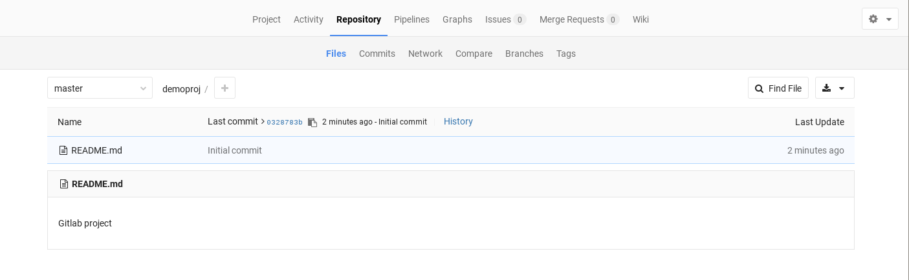

# GitLab deployment on Bluemix Kubernetes Container Service

## Overview
This project shows how a common multi-component application can be deployed
on the Bluemix container service with Kubernetes clusters. Each component runs in a separate container
or group of containers. 

Gitlab represents a typical multi-tier app and each component will have their own container(s). The microservice containers will be for the web tier, the state/job database with Redis and PostgreSQL as the database.


## Included Components
- Bluemix container service
- Kubernetes
- GitLab
- NGINX
- Redis
- PostgreSQL

## Prerequisite

Create a Kubernetes cluster with IBM Bluemix Container Service. 

If you have not setup the Kubernetes cluster, please follow the [Creating a Kubernetes cluster](https://github.com/IBM/container-journey-template) tutorial.

## QuickStart

For QuickStart, please go over [step 3](#3-create-services-and-deployments). We will use the images from DockerHub for QuickStart. If you want to build your private images, please follow the detailed [steps](#steps).


## Steps

1. [Instal Bluemix and Container Service CLI Tools](#1-install-cli-tools)
2. [Build PostgreSQL, Redis and Gitlab containers](#2-build-containers)
3. [Create Services and Deployments](#3-create-services-and-deployments)
4. [Using Gitlab](#4-using-gitlab)

# 1. Install Bluemix and Container Service CLI tools

> Note: If you do not want to build your private images for gitlab, please skip to [Create Services and Deployments](#3-create-services-and-deployments).

Install the Bluemix Container Service Cloud Foundry plug-in.

```bash
cf install-plugin https://static-ice.ng.bluemix.net/ibm-containers-linux_x64
```

Once the plugin is installed you can log into the Bluemix Container Service.
First, you must log into Bluemix through the CloudFoundry CLI.

```bash
cf login -a https://api.ng.bluemix.net
```

If this is the first time using the container service you must initialize the plugin and
set a namespace which identifies your private Bluemix images registry. It can be between 4 and 30 characters.

```bash
cf ic init
cf ic namespace set <namespace>
```

Then you must log into the Bluemix Container Service.

```bash
cf ic login
```

Verify that it works.

```bash
cf ic images
```

This should return a list of images from the default Bluemix registry.

        REPOSITORY                                            TAG                 IMAGE ID            CREATED             SIZE
        registry.ng.bluemix.net/ibmnode                       v1.2                640ed14065df        5 weeks ago         188 MB
        registry.ng.bluemix.net/ibmliberty                    microProfile        50854bcc98c3        2 months ago        237 MB
        registry.ng.bluemix.net/ibm-backup-restore            latest              4b5d9037c97a        5 weeks ago         208 MB
        registry.ng.bluemix.net/ibmliberty                    javaee7             96285b81d9df        2 months ago        314 MB
        registry.ng.bluemix.net/ibmliberty                    latest              96285b81d9df        2 months ago        314 MB
        registry.ng.bluemix.net/ibm-websphere-extreme-scale   latest              f98d12aad014        8 days ago          466 MB
        registry.ng.bluemix.net/ibm-node-strong-pm            latest              3fc4ae24eb0e        4 weeks ago         259 MB
        registry.ng.bluemix.net/ibmnode                       v1.1                fd4d70c5451b        5 weeks ago         181 MB
        registry.ng.bluemix.net/ibm-integration-bus           latest              ec198557875c        5 weeks ago         683 MB
        registry.ng.bluemix.net/ibmnode                       latest              acec21732cb5        5 weeks ago         192 MB
        registry.ng.bluemix.net/ibmnode                       v4                  acec21732cb5        5 weeks ago         192 MB
        registry.ng.bluemix.net/ibm-mq                        latest              9b6ae7557a34        8 days ago          771 MB
        registry.ng.bluemix.net/ibm_wa_agent                  latest              3d38f3e80fd7        2 weeks ago         435 MB
        registry.ng.bluemix.net/ibmliberty                    webProfile6         211f521035a2        2 months ago        268 MB
        registry.ng.bluemix.net/ibmliberty                    webProfile7         6b2b8341fa32        2 months ago        276 MB


# 2. Build PostgreSQL, Redis and Gitlab containers

Build the PostgreSQL container.

```bash
cd containers/postgres
cf ic build -t registry.ng.bluemix.net/<namespace>/gitlab-postgres .
```

Build the Gitlab container.

```bash
cd containers/gitlab
cf ic build -t registry.ng.bluemix.net/<namespace>/gitlab .
```

The redis container from Docker Hub can be used without modification so it just needs to be imported.

```bash
cf ic cpi redis:alpine registry.ng.bluemix.net/<namespace>/redis
```

After finish building the images in bluemix registery, please modify the container images in your yaml files. 

i.e. 
1. In postgres.yaml, change `docker.io/tomcli/postgres:latest` to `registry.ng.bluemix.net/<namespace>/gitlab-postgres`
2. In redis.yaml, change `redis:alpine` to `registry.ng.bluemix.net/<namespace>/redis`
3. In gitlab.yaml, change `docker.io/tomcli/gitlab:latest` to `registry.ng.bluemix.net/<namespace>/gitlab`

> Note: Replace `<namespace>` to your own cloudfoundry namespace. You can check your namespace via `cf ic namespace get`

# 3. Create Services and Deployments

Run the following commands or run the quickstart script `bash quickstart.sh` with your Kubernetes cluster.

```bash
kubectl create -f postgres.yaml
kubectl create -f redis.yaml
kubectl create -f gitlab.yaml
```
After you created all the services and deployments, wait for 3 to 5 minutes and run the following commands to get your public IP and NodePort number.

```bash
$ kubectl get nodes
NAME             STATUS    AGE
169.47.241.106   Ready     23h
$ kubectl get svc gitlab
NAME      CLUSTER-IP    EXTERNAL-IP   PORT(S)        AGE
gitlab    10.10.10.90   <nodes>       80:30911/TCP   16h
```

Congratulation. Now you can use the link **http://[IP]:[port number]** to access your gitlab site.

> Note: For the above example, the link would be http://169.47.241.106:30911  since its IP is 169.47.241.106 and its port number is 30911. 


# 4. Using Gitlab
Now that Gitlab is running you can register as a new user and create a project.




After logging in as your newly-created user you can create a new project.



Once a project has been created you'll be asked to add an SSH key for your user.

To verify that your key is working correctly run:

```bash
ssh -T git@<IP>
```

Which should result in:

```bash
Welcome to GitLab, <user>!
```

Now you can clone your project.
```bash
git clone <project URL>
```

Add a file and commit:
```bash
echo "Gitlab project" > README.md
git add README.md
git commit -a -m "Initial commit"
```

You can now see it in the Gitlab UI.


# Troubleshooting
If a container doesn't start examine the logs.
```bash
cf ic ps
cf ic logs -t <container ID>
```


To delete all your services and deployments, run

```bash
kubectl delete deployment,service -l app=gitlab
```

# License
[Apache 2.0](LICENSE.txt)
